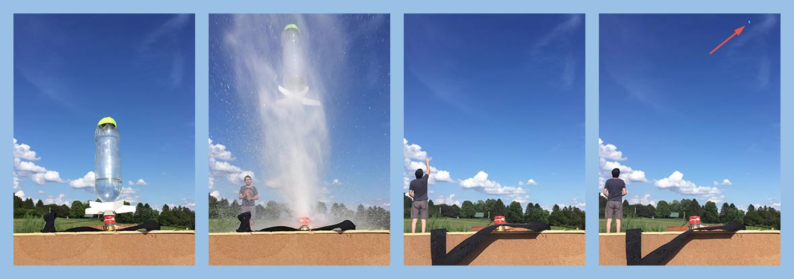
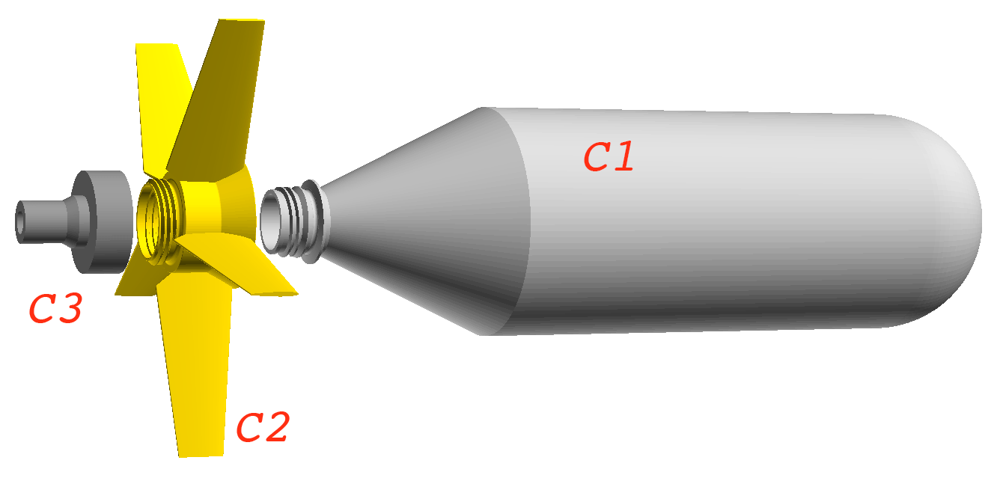
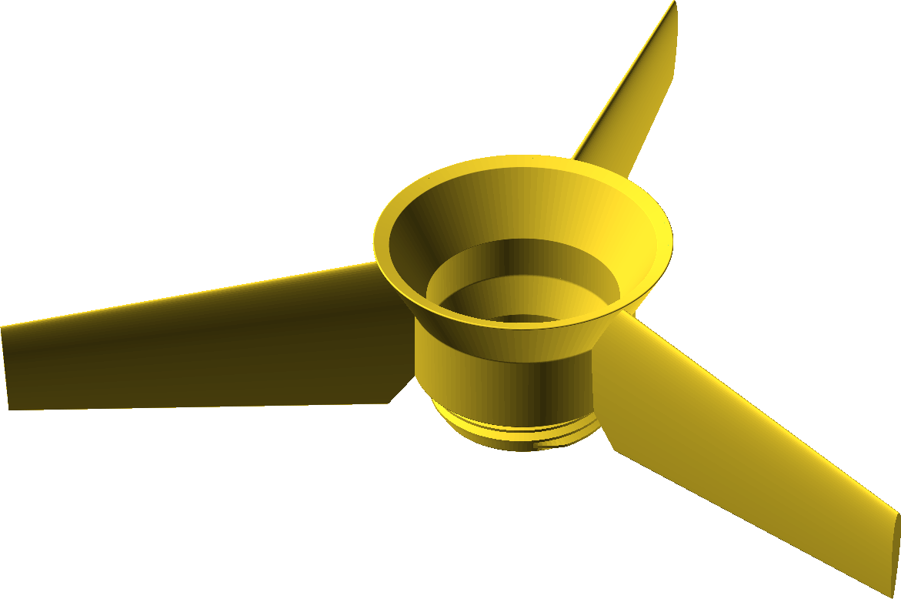
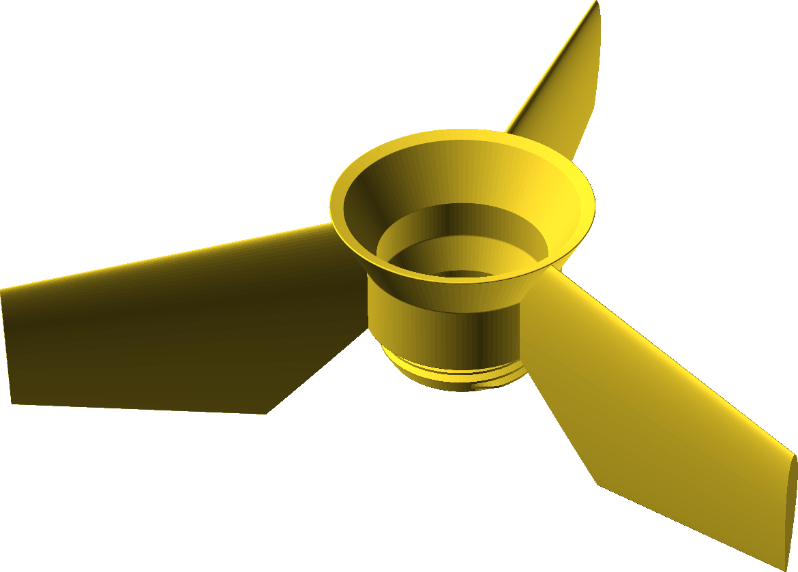
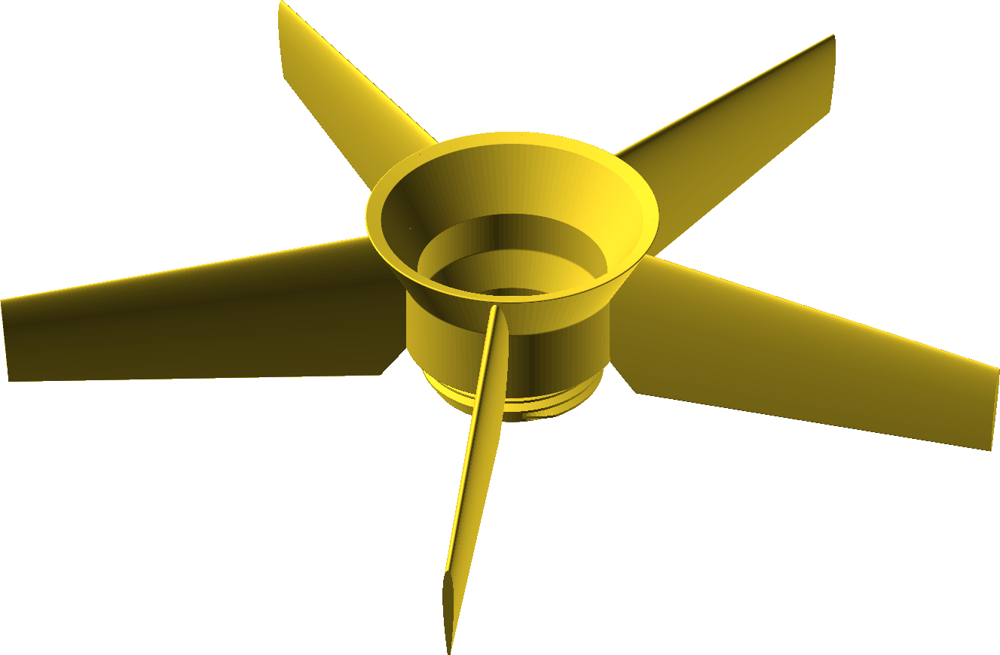

# Fins for PET-Bottle Water-Rockets

PET-bottle water rockets are fun. And if you have children, you already have
an engineering-, launch-, and recovery team. Let an adult take responsibility
for [safety](http://www.aircommandrockets.com/safety.htm): Exploding
pressure tanks (i.e., water rockets) are dangerous!
To learn more about water rockets, check out the excellent articles by 
[Air Command Water Rockets](http://www.aircommandrockets.com).
The usual way to create a very simple rocket is:

- glue fins to PET bottle
- glue nozzle to PET bottle
- tape nose cone to PET, possibly adding some weight for stable flight

Then bring your launch pad to some vast, empty area, fuel your rocket
with water, pressurize using a bicycle pump, and launch.

_Tricky part_: Glueing to PET.

_Solution_: Screw-on fins that also provide
a thread-adapter from PCO-1881 (PET-bottle thread) to 1" British
Standard Pipe Thread (Gardena(tm) tap-connector).

Note that the threads in C2 do _not_ act as seals: The lip of the bottle C1
will directly seal to the gasket inside the tap connector C3.

Some bottle-shapes may not fit into the fin-adapter. Coke bottles work nicely,
though. It should not matter much which type of garden hose connector you use
as long as it has a 1" British Standard Pipe Thread (often abbreviated
as G-1"). I use [these](https://www.gardena.com/int/products/watering/hose-fittings/tap-connector-33-3-mm-g-1/967312601/).

## Rocket-Fin Variants

These variants for C2 are currently available:

| Part-# | Name           | Picture                                              |
| -------| -------------- |----------------------------------------------------- |
|   PN1  | 3 narrow fins  |  |
|   PN2  | 3 broad fins   |   |
|   PN3  | 5 narrow fins  |  |
